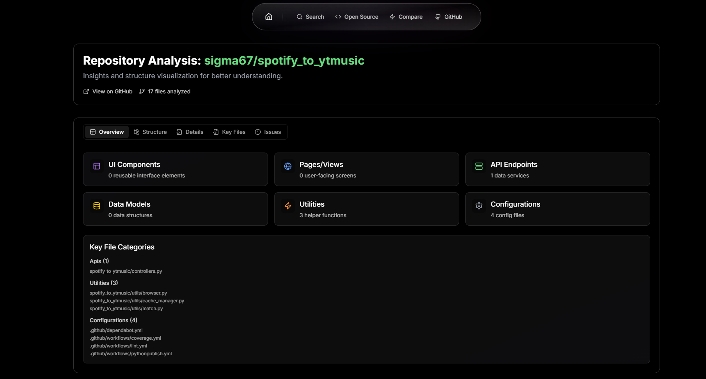
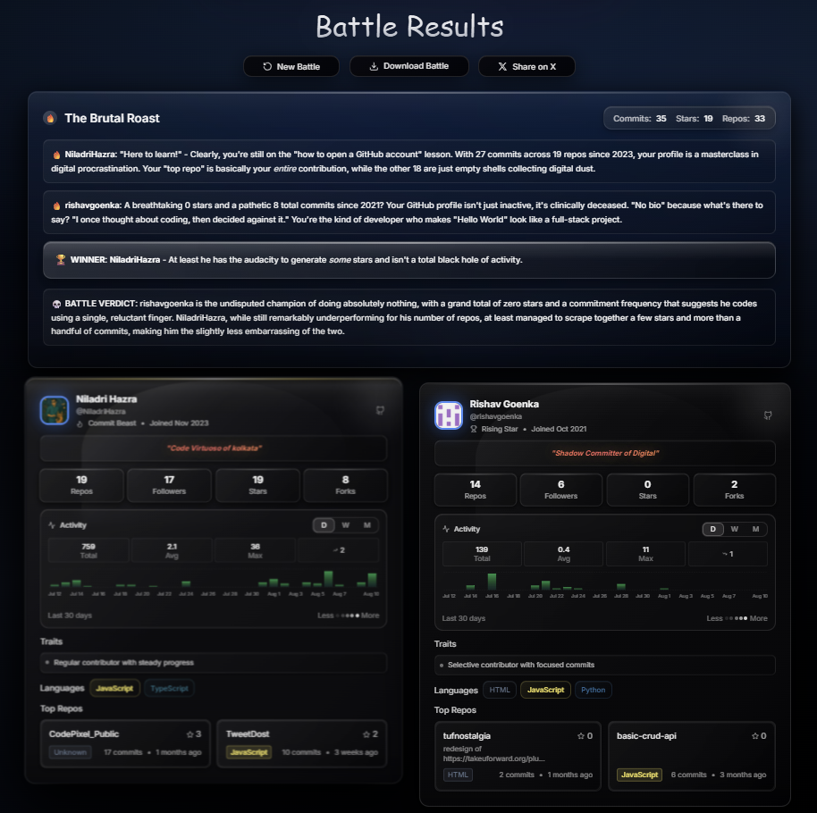
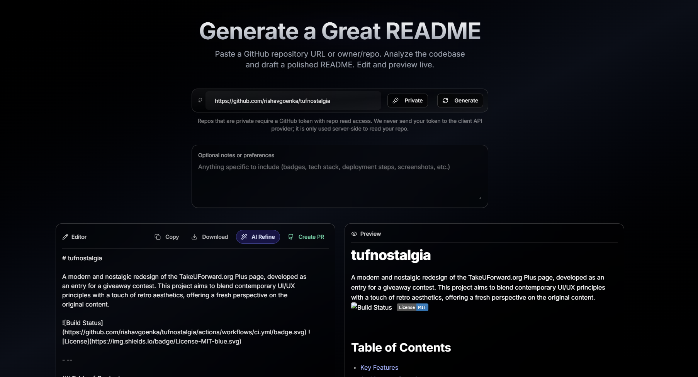
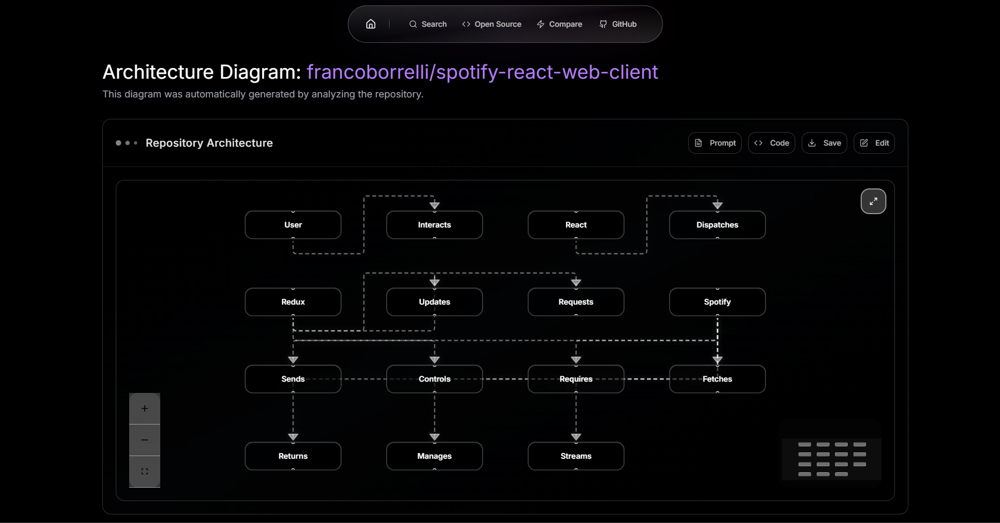

#  What to Build?

> **Discover, analyze, and build amazing projects with comprehensive GitHub insights**

[](https://wtb.niladri.tech)

[](LICENSE)

## ✨ What is WhatToBuild?

WhatToBuild is an  platform that helps developers discover, analyze, and understand open-source projects. Whether you're looking for inspiration, trying to understand complex codebases, or comparing developer profiles, WhatToBuild provides comprehensive insights to accelerate your development journey.

## 🌟 Key Features

### 🔍 **Smart Project Search**
- **Discovery**: Find relevant repositories based on concepts and ideas
- **Project Idea Generation**: Get AI-generated project suggestions with tech stacks
- **Relevance Scoring**: Advanced algorithms rank projects by relevance to your query
- **Technology Filtering**: Search by programming languages and frameworks


### 📊 **Deep Repository Analysis**
- **Code Structure Analysis**: Understand project architecture and file organization
- **Technology Stack Detection**: Automatic identification of frameworks, libraries, and tools
- **Dependency Mapping**: Visualize project dependencies and relationships
- **File Content Summarization**: AI-powered summaries of key source files
- **Contributor Insights**: Analyze team composition and contribution patterns



### ⚖️ **Developer Comparison**
- **Profile Analytics**: Compare GitHub profiles side-by-side
- **Contribution Patterns**: Analyze coding activity and project diversity
- **Repository Quality**: Evaluate star counts, fork ratios, and project impact
- **Language Expertise**: Compare programming language proficiency
- **Activity Metrics**: Track commits, issues, and collaboration patterns



### 📝 **Generate a Great README**
- **Instant Draft**: Analyze your GitHub repository to generate a high‑quality README in seconds
- **Flexible Input**: Use `owner/repo` or a full GitHub URL
- **Personalization**: Add optional notes to steer tone, structure, and highlights
- **Live Preview**: Edit Markdown with a GitHub‑flavored live preview side‑by‑side
- **AI Refine**: Improve sections, wording, and structure via Google Gemini
- **One‑Click Actions**: Copy, download, or create a PR to update `README.md` in your repo
- **Private Repos**: Use a personal access token in-session for secure access



### 🎨 **Interactive Visualizations**
- **Architecture Diagrams**: Generate visual representations of project structure
- **Dependency Graphs**: Interactive visualization of project dependencies
- **Technology Stack Charts**: Visual breakdown of technologies used
- **Contribution Heatmaps**: Timeline visualization of developer activity



### 🔓 **Open Source Discovery**
- **Good First Issues**: Find beginner-friendly contribution opportunities
- **Bounty Issues**: Discover paid contribution opportunities
- **Language-Specific Search**: Filter by programming languages
- **Project Categorization**: Browse projects by type and domain


## 🛠️ Technology Stack

### **Frontend**
- **Next.js 15.4.5** - React framework with App Router
- **React 19.1.0** - Modern UI library with latest features
- **TypeScript** - Type-safe development (98.2% of codebase)
- **Tailwind CSS 4.1.11** - Utility-first styling
- **Framer Motion** - Smooth animations and transitions

### **UI Components**
- **Radix UI** - Accessible component primitives
- **Lucide React** - Beautiful icon library
- **React Icons** - Additional icon sets
- **Chart.js & Recharts** - Data visualization
- **React Three Fiber** - 3D graphics and animations

### **AI & APIs**
- **Google Generative AI** - AI-powered analysis and summaries
- **GitHub API** - Repository data and insights
- **Mermaid** - Diagram generation

### **Development Tools**
- **ESLint** - Code linting and quality
- **Autoprefixer** - CSS vendor prefixes
- **PostCSS** - CSS processing

## 🚀 Getting Started

### Prerequisites
- Node.js 18+      
- npm, yarn, pnpm, or bun
- GitHub API access (for full functionality)

### Installation

1. **Clone the repository**
```bash
git clone https://github.com/NiladriHazra/WhatToBuild.git
cd WhatToBuild
```

2. **Install dependencies**
```bash
npm install
# or
yarn install
# or
pnpm install
# or
bun install
```

3. **Set up environment variables**
```bash
cp .env.example .env.local
```

Add your API keys to `.env.local`:
```env
GITHUB_TOKEN=your_github_token_here
GOOGLE_AI_API_KEY=your_google_ai_key_here
```

4. **Run the development server**
```bash
npm run dev
# or
yarn dev
# or
pnpm dev
# or
bun dev
```

5. **Open your browser**
Navigate to [http://localhost:3000](http://localhost:3000) to see the application.

## 📱 Usage

### Search Projects
1. Visit the homepage and enter a concept or technology
2. Browse AI-generated project ideas and relevant repositories
3. Use filters to refine results by language, stars, or activity

### Analyze Repositories
1. Click "Analyze" on any repository or enter a GitHub URL
2. Explore file structure, dependencies, and code summaries
3. View technology stack and architectural insights

### Compare Developers
1. Navigate to the Compare section
2. Enter two GitHub usernames
3. Review detailed comparison metrics and visualizations

### Visualize Architecture
1. Select "Visualize" for any repository
2. Generate interactive diagrams and dependency graphs
3. Export diagrams for documentation

## 🏗️ Project Structure

```
WhatToBuild/
├── app/                    # Next.js App Router pages
│   ├── analyze/           # Repository analysis
│   ├── compare/           # Developer comparison
│   ├── search/            # Project search
│   ├── visualize/         # Architecture visualization
│   └── api/               # API routes
├── components/            # React components
│   ├── Hero/             # Landing page sections
│   ├── ui/               # Reusable UI components
│   └── page/             # Page-specific components
├── lib/                  # Utility functions
│   ├── github.ts         # GitHub API integration
│   ├── gemini.ts         # AI service integration
│   └── utils.ts          # Helper functions
├── config/               # Configuration files
└── public/               # Static assets
```

## 🤝 Contributing

We welcome contributions! Here's how to get started:

1. **Fork the repository**
2. **Create a feature branch**
   ```bash
   git checkout -b feature/amazing-feature
   ```
3. **Make your changes**
4. **Commit with conventional commits**
   ```bash
   git commit -m "feat: add amazing feature"
   ```
5. **Push to your branch**
   ```bash
   git push origin feature/amazing-feature
   ```
6. **Open a Pull Request**

### Development Guidelines
- Follow TypeScript best practices
- Use conventional commit messages
- Add tests for new features
- Update documentation as needed

## 📄 License

This project is licensed under the MIT License - see the [LICENSE](LICENSE) file for details.

## 🙏 Acknowledgments

- **GitHub API** for providing comprehensive repository data
- **Google Generative AI** for powering intelligent analysis
- **Vercel** for seamless deployment and hosting
- **Next.js Team** for the amazing framework
- **Open Source Community** for inspiration and tools

## 📊 Project Stats

- **Language Composition**: 98.2% TypeScript, 1.7% CSS, 0.1% JavaScript
- **Dependencies**: 40+ production packages
- **Components**: Modular, reusable architecture
- **Performance**: Optimized with Next.js 15 features

## 🔗 Links

- **Live Demo**: [what-to-build.niladri.tech](https://what-to-build.niladri.tech)
- **Repository**: [github.com/NiladriHazra/WhatToBuild](https://github.com/NiladriHazra/WhatToBuild)
- **Issues**: [Report bugs or request features](https://github.com/NiladriHazra/WhatToBuild/issues)

---

<div align="center">

  Built with ❤️ by [Niladri Hazra](https://github.com/NiladriHazra)  
  ⭐ Star this repo if you find it helpful!

</div>

